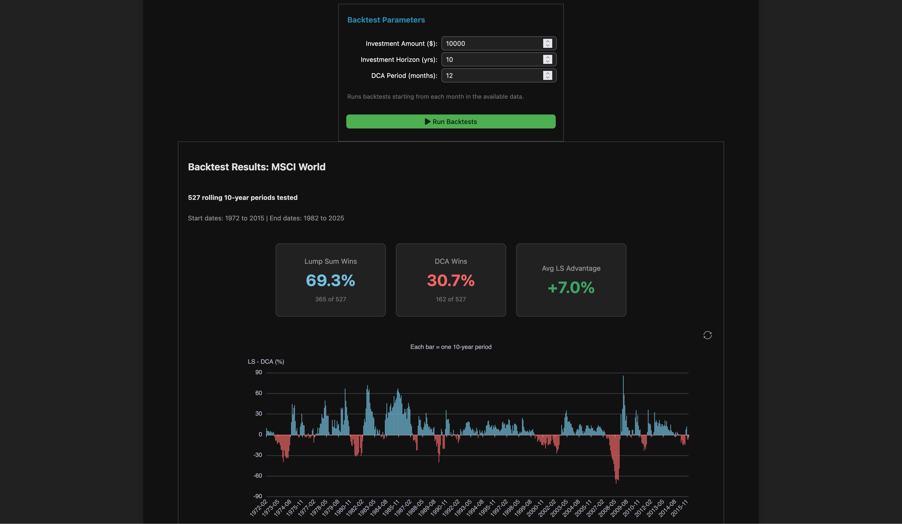

# Lump Sum vs DCA

Interactive analysis comparing Lump Sum vs Dollar Cost Averaging investment strategies using 53 years of MSCI World data (1972-2025).

## Try it online

- [English version](https://jtpio.github.io/lump-sum-vs-dca/voici/render/dca_vs_lump_sum.html)
- [French version](https://jtpio.github.io/lump-sum-vs-dca/voici/render/dca_vs_lump_sum_fr.html)



## Run locally

```bash
git clone https://github.com/jtpio/lump-sum-vs-dca.git
cd lump-sum-vs-dca
uv sync
uv run jupyter lab
```

Open one of the notebooks in the `content/` folder and run all cells.

## License

MIT
